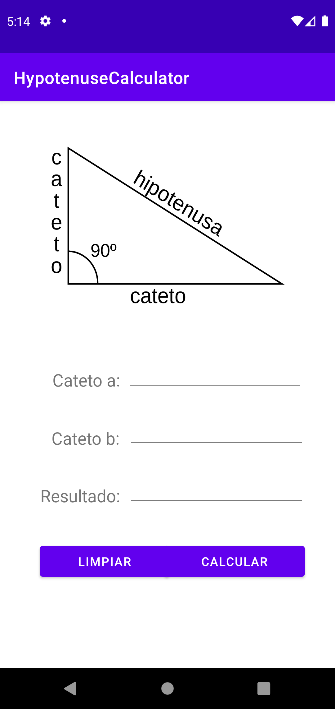
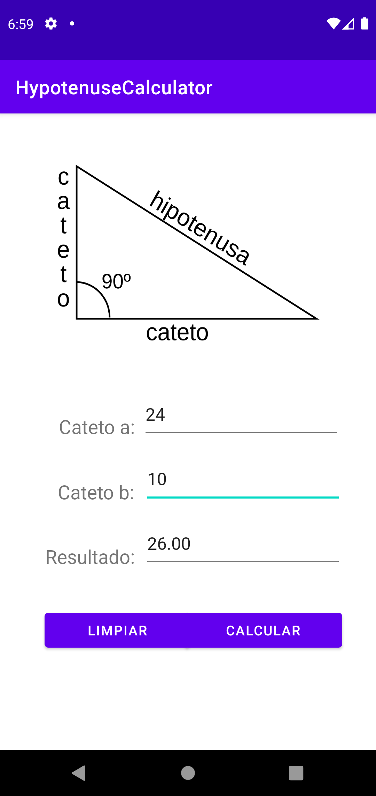

# Hypotenuse Calculator
Application coded in Kotlin that calculates the hypotenuse of a right triangle.

To develop this application i used:

  - Android Studio Arctic Fox 2020.3.1 Patch 2
  - VM: OpenJDK 64-Bit Server VM by Oracle Corporation
  - Windows 10 10.0
  - Gradle 7.02

## Requirements

This application works from Android 5.0 to the latest version.

## How to use

<table>
  <thead>
    <tr>
      <th>Images</th>
      <th>Steps</th>
    </tr>
  </thead>
  <tbody>
    <tr>
      <td>
        

          
        

      </td>
      <td>
        1. In the "Cateto a" text field you must enter the size of one of the sides of your triangule.
      </td>
    </tr>
    <tr>
      <td>
        

          
        

      </td>
      <td>
        2. In the text field "Cateto b" you must enter the size of the other side of your triangule.
      </td>
    </tr>
    <tr>
      <td>
        

          
        

      </td>
      <td>
        3. The application will show you the result in the "Resultado" text field.
      </td>
    </tr>
  </tbody>
</table> 
